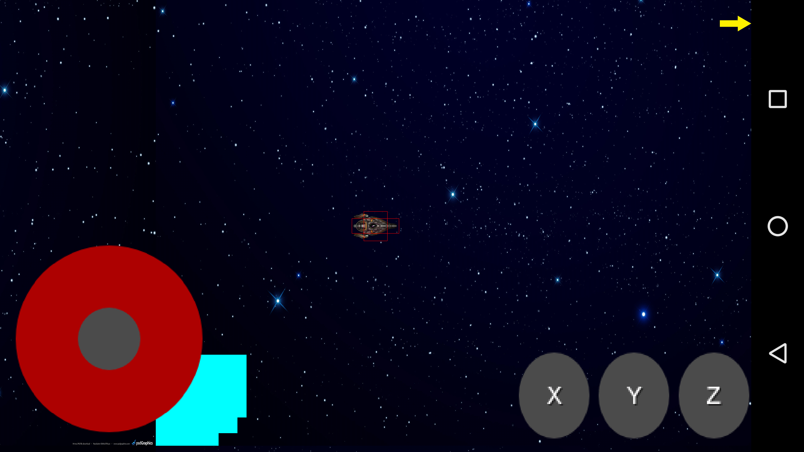

# 2D Shooter Android Game

### For development

##### Run the game only
```
./gradlew desktop:run -PappArgs="['gameonly']"
```

##### Run local server/client
```
./gradlew desktop:run -PappArgs="['local']"
./gradlew desktop:run -PappArgs="['local']"
```

### For production
IP for connecting to checking number of games
http://128.54.238.99:5000/game/

## For Testing
Go to testing branch
Run GameScreenTester

##### Run backend server
```
cd server
docker-compose up
```

##### Run a client
```
./gradlew desktop:run
```


### Example image


### Android image

